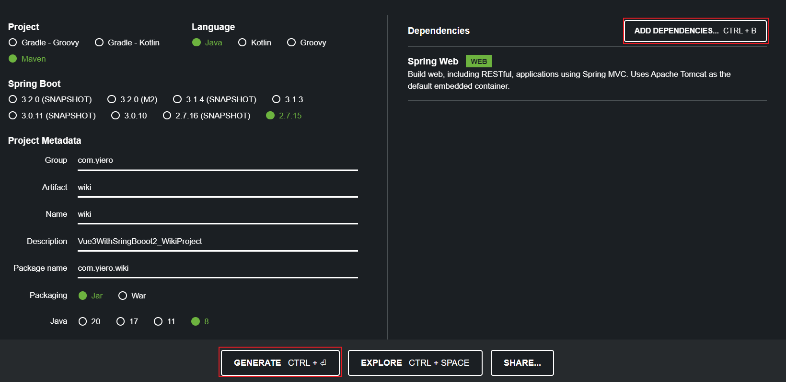
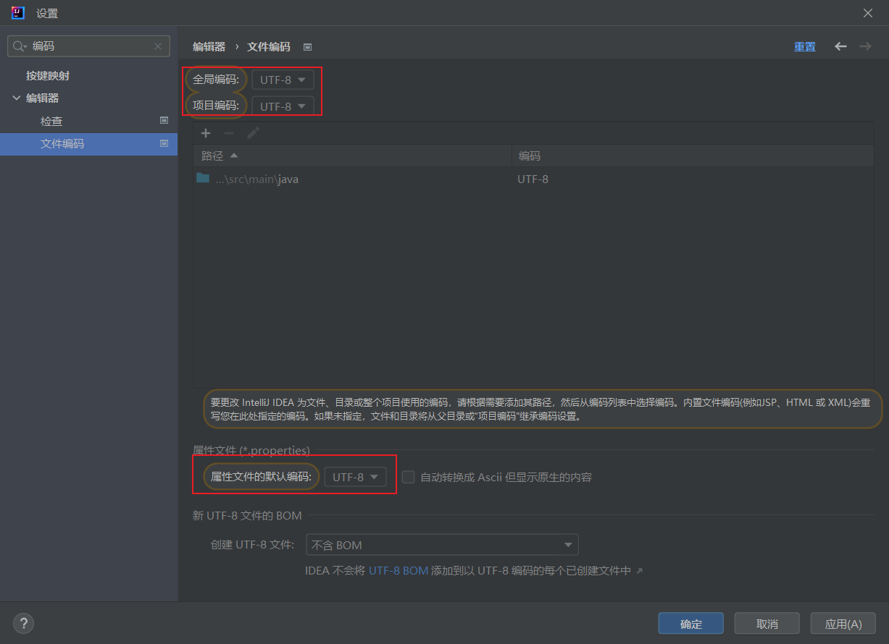
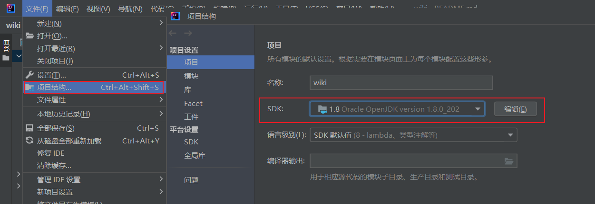

## 第二章

### 2.1 创建SpringBoot项目

**通过官网创建一个项目包, 导入idea**





### 2.2 配置IDEA

#### 2.2.1 编码设置

全部设置成UTF-8

> 中文配置搜`编码`
>
> 英文配置搜`Encoding`



#### 2.2.2 设置项目JDK

[菜单栏 -> 文件 -> 项目结构 --> 项目 -> SDK]

选择本地JDK。 



#### 2.2.3 Maven配置

 配置阿里云镜像

#### 2.2.4 git配置


## 2.3 关联远程git仓库

初始化git信息

```bat
git init
```

链接git远程仓库

```git
git remote add origin <Git Repository Link>
```


## 2.4 启动日志优化

**目的**

- 修改logback日志的样式
- 增加启动成功的日志，使其更加明显
- 修改启动图案

### 2.4.1 创建配置文件

> 在`src/resources/`目录下新建文件`logback-spring.xml`.

```xml
```


## 2.5 开发Hello World接口

### 2.5.1 项目分层

在启动类的目录下面新建一个目录, `controller/` 目录, 用于书写接口. 


#### 2.5.2 新建一个Hello World接口

在 controller 目录下新建一个类 `TestController`. 


```java
@RestController
public class TestController {

    @RequestMapping("/hello")
    public String hello() {
        return "hello world.";
    }
}
```


访问 `http://localhost:8080/hello`, 发现正常返回. 

### 2.5.3 声明请求API注解

**类注解**

- `@RestController` 表示下面的接口返回一个文本或者json格式

---

**方法注解**

- `@GetMapping( api )` 注解下面的方法是一个Get请求
- `@PostMapping( api )` 注解下面的方法是一个Post请求
- `@PutMapping( api )` 注解下面的方法是一个Put请求
- `@DeleteMapping( api )` 注解下面的方法是一个Delete请求
- `@RequestMapping( api )` 注解下面的方法是允许所有请求
- `@RequestMapping( value = <api>, method = RequestMethod.GET )`

---

**SpringBoot返回码**

- 405: 请求类型与接口不一致
- 404: 没有扫描到接口 / 接口不存在


## 2.5.4 项目文件识别

默认情况下, 通过入口文件 `WikiApplication `启动项目会识别从入口文件开始及其之后的文件. 

但是如果我们将入口文件移动到其他地方, 比如移动到 `config/WikiApplication`, 这时候如果启动项目, 访问`/hello`, 会出现404报错, 因为无法识别到对应接口. 

我们需要手动添加注解, 让入口文件扫描整个项目. 

`@ComponentScan("com.包名")`


```java
@SpringBootApplication
@ComponentScan("com.yiero")
public class WikiApplication {
   // main method
}
```


## 2.6 使用Http Client测试接口


## 2.7 自定义SpringBoot配置文件


## 2.8 集成热部署